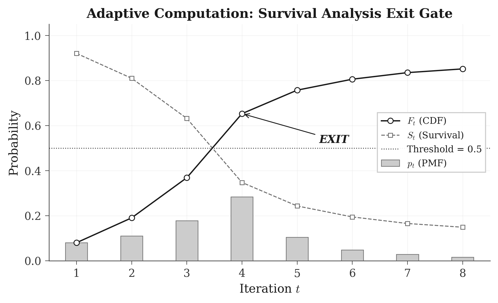
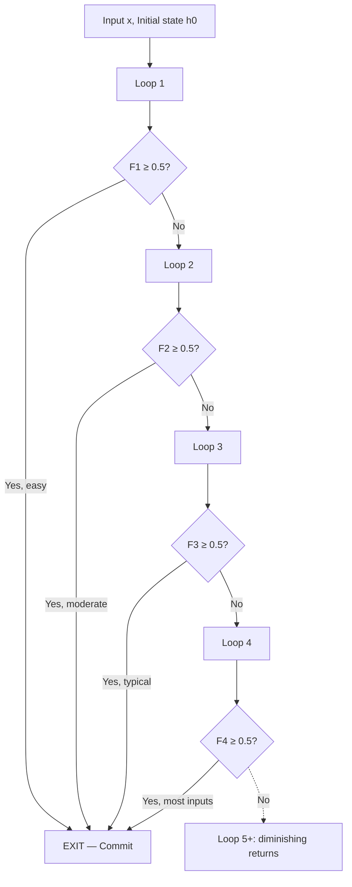
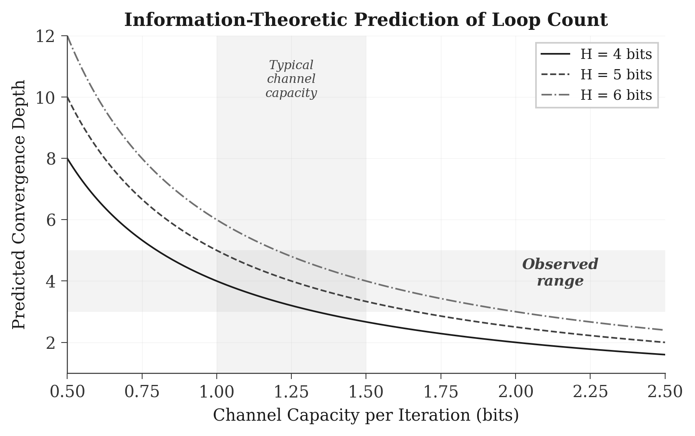
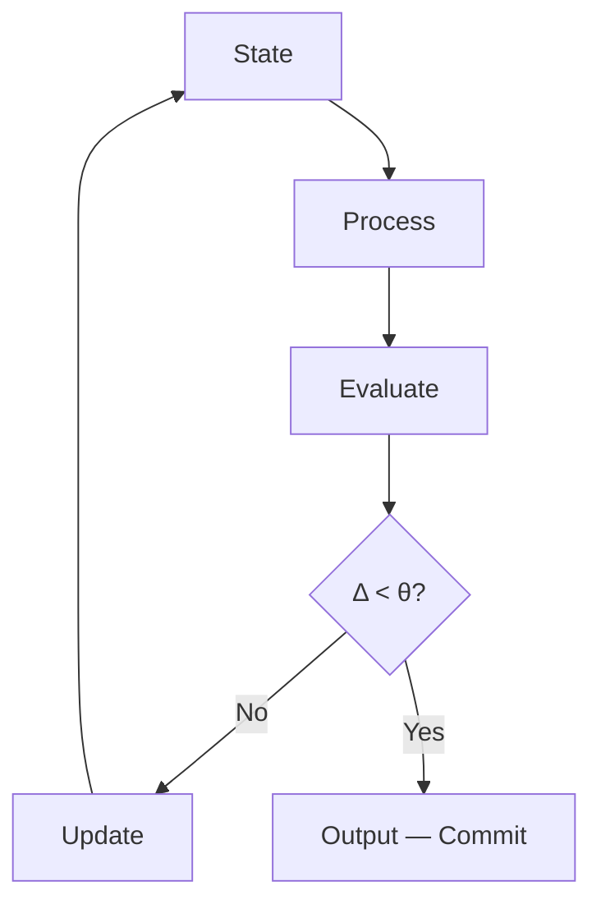
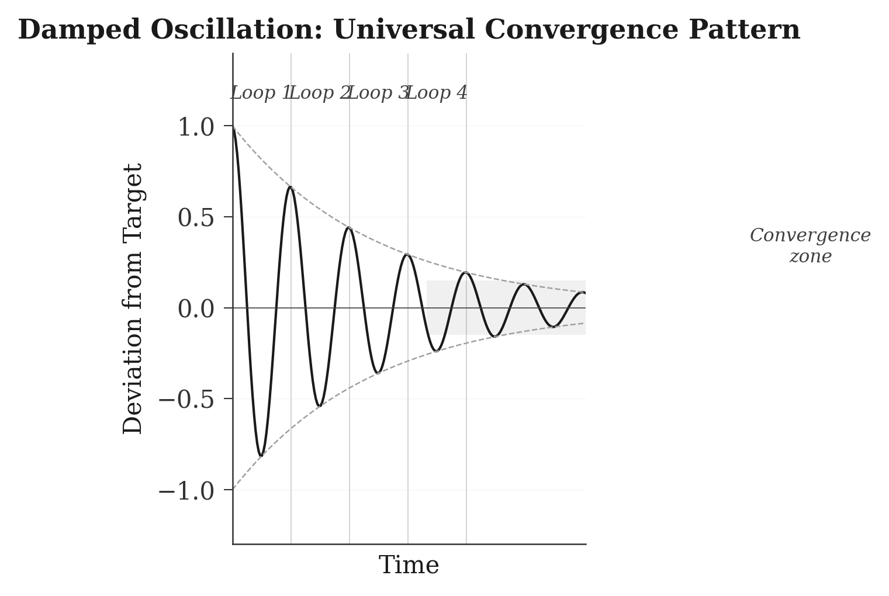
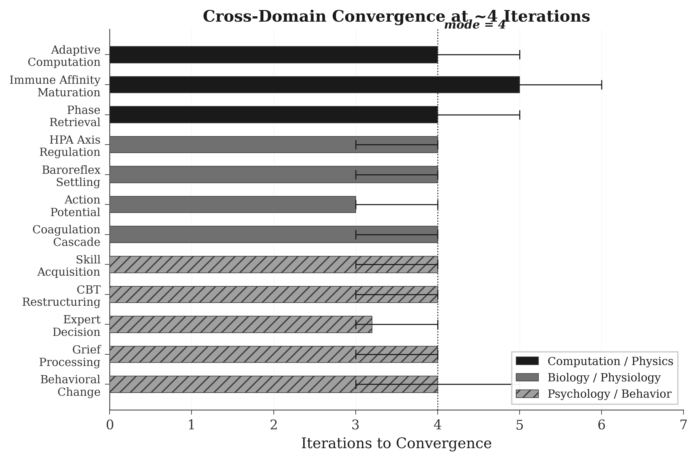
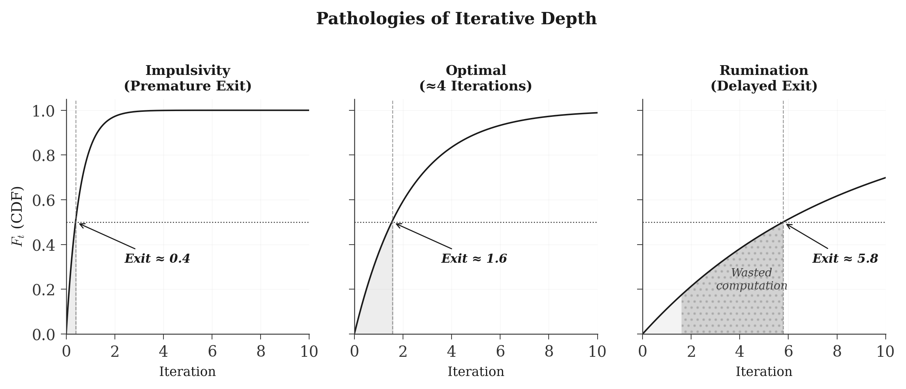
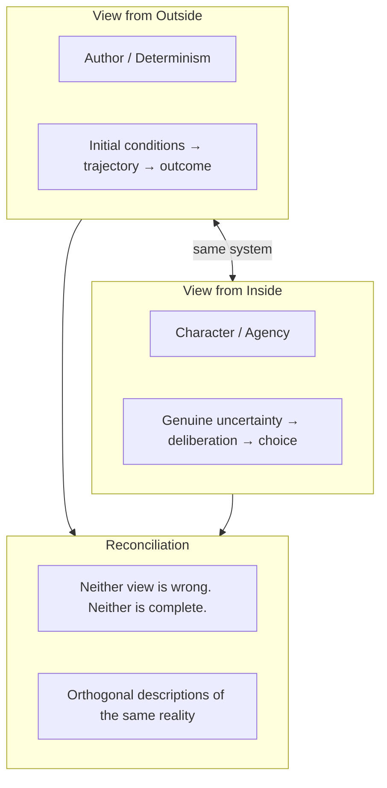

# Four-Loop Convergence

*Iterative Depth as a Universal Computational Primitive*

**James Rosing, MD, FACS**
*Allure MD Plastic Surgery & Dermatology, Newport Beach, California*

Draft, February 2026

**WORKING PAPER**

*Authored with the interactive assistance of Claude Opus 4.6*

---

## Abstract

The depth of iterative processing, how many loops a system runs before committing to an output, converges to the same value across unrelated systems.

Across adaptive neural computation, immune affinity maturation, crystallographic phase retrieval, homeostatic regulation, cognitive skill acquisition, therapeutic behavioral change, group dynamics, and volitional decision-making, a striking regularity emerges: iterative systems processing ambiguous information through a fixed substrate converge in approximately three to five iterations, with a mode of four. This paper proposes the **Four-Loop Hypothesis**: this convergence reflects a fundamental information-theoretic constraint on feedback-coupled systems. Each iteration contributes approximately 1 to 1.5 bits of effective information toward resolving uncertainty. Since most decisions require 4 to 6 bits to resolve (distinguishing among 16 to 64 states), the ratio of decision complexity to per-iteration channel capacity predicts convergence at three to five iterations from first principles.

The hypothesis extends into psychology, where the pathologies of iterative depth (rumination as excessive looping, impulsivity as premature exit, paralysis as threshold stagnation) map onto well-characterized clinical phenomena. The framework also addresses the coexistence of determinism and experienced agency: the subjective experience of free will may be understood as the felt correlate of meta-cognitive loop monitoring, itself bounded by the same four-iteration constraint. The deviations from the norm are not errors but elements of a distribution whose variance is functionally essential.

---

## I. Computational Observation

> *"The important thing in science is not so much to obtain new facts as to discover new ways of thinking about them."*
>
> Sir William Lawrence Bragg, *A Short History of Science* (1951)

### Adaptive Depth in Neural Computation

Recent work in adaptive computation introduces a mechanism by which transformers allocate variable processing to different inputs. Rather than passing every input through a fixed number of layers, these architectures incorporate learned exit gates that determine when processing is complete. The formalism draws on discrete-time survival analysis. At each step *t*, a learned exit gate outputs a hazard rate λₑ = σ(Linear(hᵗ)), the instantaneous probability of halting conditioned on not having halted previously.

Raw hazard rates need not sum to one and cannot serve as exit probabilities directly. The survival analysis framework derives three quantities: the survival function Sₑ = ∏(1 − λᵢ), representing the probability of persisting beyond step *t*; the probability mass function pₑ = Sₑ₋₁ · λₑ, the probability of exiting at exactly step *t*; and the cumulative distribution function Fₑ = Σ pᵢ, the probability of having exited by step *t*. The model halts when Fₑ ≥ 0.5.

*Figure 1. Survival analysis exit gate. The CDF Fₑ accumulates exit probability across iterations. When Fₑ crosses the commitment threshold (0.5), the model halts. Easy inputs exit early; most inputs converge at approximately four iterations.*

The following diagram illustrates the exit gate architecture:

*Figure 2. Exit gate architecture. At each loop, the model computes a hazard rate λ from the updated hidden state. The cumulative distribution F determines whether to commit or iterate. Most inputs exit at Loop 4.*

The motivating empirical finding is simple. When these systems are trained end-to-end with the exit mechanism, the effective loop depth for the vast majority of inputs converges to approximately four iterations. Easy inputs requiring pattern matching or direct retrieval exit at loop one or two. Difficult inputs requiring multi-step composition or ambiguity resolution use three to four loops. Beyond four, marginal information gain per iteration falls below computational cost.

### Training-Time versus Inference-Time

A critical distinction separates training-time and inference-time looping. When trained with exit gates from the outset, a model organizes its internal representations around the loop structure. The residual stream becomes loop-aware: early layers deposit intermediate results in formats optimized for iterative refinement. The exit gate learns which inputs require additional computation.

Inference-time looping, where a normally trained model is run again with its outputs fed back through the same weights, produces different results. Representations were not optimized for iterative refinement. Each pass operates on activations increasingly distant from the training distribution. Quality degrades. The crossover point, where inference-time looping transitions from marginal benefit to active degradation, occurs at approximately four iterations.

### An Information-Theoretic Conjecture

Why four? If each iteration roughly halves remaining uncertainty, four iterations reduce it by a factor of 2⁴ = 16. Starting from a state with 10 to 20 plausible interpretations, four halvings yield one dominant state. If the effective channel capacity of each iteration is approximately 1 to 1.5 bits, and most decisions require resolution among 10 to 100 possibilities (roughly 4 to 6 bits of entropy), then the predicted convergence depth is:

> *Depth ≈ H(initial) / C(iteration) ≈ 4–6 bits / 1–1.5 bits ≈ 3–5 iterations*

*Figure 3. Information-theoretic prediction of convergence depth. For typical biological channel capacities (1–1.5 bits/iteration) and decision entropies (4–6 bits), the predicted loop count falls in the observed range of 3–5.*

This conjecture is testable. Measuring the effective channel capacity of a feedback pathway and the entropy of the initial perturbation should predict the loop count from first principles.

---

## II. Convergence Across Natural Systems

> *"What I cannot create, I do not understand."*
>
> Richard Feynman, blackboard at Caltech, February 1988

**Instantiations:**

| Domain | State → Process → Evaluate |
|---|---|
| **ML** | hidden state → transform → exit gate |
| **Immune** | antibody → mutate → affinity select |
| **Crystal** | phase → project → evaluate fit |
| **HPA** | cortisol → feedback → suppress CRH |
| **CBT** | belief → test → restructure |
| **Decision** | plan → simulate → evaluate |

*Figure 4. The universal iterative pattern and its instantiations across domains. Each system iterates through the same abstract cycle: state, process, evaluate, update. The specific substrate differs; the structure is invariant.*

### Immune Affinity Maturation

The adaptive immune system faces a problem structurally identical to adaptive computation: given a fixed combinatorial library of antibody gene segments, generate a high-affinity binder for a novel antigen. The system does not acquire new germline information upon encountering a pathogen. It iterates. Somatic hypermutation introduces variation, selection pressure in germinal centers evaluates binding affinity, and surviving B cells proliferate to seed the next round. Each cycle does not add new knowledge. It manipulates existing knowledge with increasing precision.

The number of affinity maturation cycles required to produce a high-affinity antibody is approximately four to six rounds. Each round yields measurable improvement, but marginal gains diminish rapidly after the fourth cycle. Further iteration introduces deleterious mutations more readily than beneficial ones. This is the biological equivalent of inference-time degradation.

### Crystallographic Phase Retrieval

When X-rays diffract through a crystal, the detector records magnitudes but loses phases. Since three-dimensional structure requires both, the phase problem was for decades considered fundamental. The breakthrough came not from new measurements but from iterative algorithms alternating between real-space and reciprocal-space constraints, progressively refining a phase estimate. Same data, looped through complementary constraint manifolds. No new information required.

Modern phasing algorithms such as charge flipping typically converge in three to five alternating projections. The convergence rate depends on the angle between constraint surfaces at their intersection. For typical crystallographic problems, this geometry predicts convergence in approximately four cycles.

### Homeostatic Regulation

The hypothalamic-pituitary-adrenal axis responds to acute stress through a cascade: CRH from the hypothalamus drives ACTH from the pituitary, which drives cortisol from the adrenals, which suppresses hypothalamic CRH output. The system overshoots, corrects, overshoots with diminished amplitude, and converges. Empirical settling time after acute perturbation is approximately three to four dampened oscillation cycles.

The baroreflex demonstrates the same pattern at higher temporal resolution. A step perturbation in blood pressure triggers baroreceptor firing, vagal modulation, and heart rate adjustment, reaching steady state in approximately four cardiac cycles. This is directly observable on the arterial line during surgery.

*Figure 5. Damped oscillation as a universal convergence pattern. Perturbation from equilibrium decays through successive loops, with the system settling within the convergence zone by approximately the fourth oscillation cycle. The envelope shows exponential decay of residual uncertainty.*

### Positive Feedback and Commitment

Positive feedback systems amplify rather than correct. They do not diverge indefinitely; they converge to a switching event in a small number of iterations. The action potential cycles approximately three to four times through the sodium channel population before threshold. The coagulation cascade proceeds through approximately four major amplification steps from platelet adhesion to stable fibrin clot. The Ferguson reflex in labor escalates through three to four phases before delivery. The mechanism differs from negative feedback, but the iteration count is the same.

### Evolution as Iterative Depth

The genetic machinery of life has remained fundamentally unchanged for billions of years. That is the fixed substrate. The complexity of the biosphere arises from iterative application of existing tools: copy, vary, select, repeat. Major adaptive radiations are driven by deeper combinatorial deployment of existing regulatory machinery, particularly gene regulatory networks and the recursive use of Hox genes.

*Figure 6. Cross-domain convergence. Across computation, biology, and psychology, the iteration count at convergence clusters between 3 and 5, with a mode of 4. Error bars show observed ranges.*

The meta-pattern across all domains admits a single statement: the elusive thing was never more information. It was sufficient iterative depth to extract what was already latent in the information available.

---

## III. The Iterating Mind

> *"We do not learn from experience. We learn from reflecting on experience."*
>
> Commonly attributed to John Dewey; paraphrased from *How We Think* (1933)

### Skill Acquisition

Motor and cognitive skill acquisition shows a four-phase structure when measured with sufficient resolution. The first attempt is governed by conscious declarative processing. The second incorporates error correction but overcompensates. The third calibrates. The fourth consolidates into automaticity. In surgical training: the first suture placement is mechanical recall, the second overcorrect tension and spacing, the third finds the rhythm, and the fourth is when the attending stops watching the trainee's hands and starts watching tissue response.

Dreyfus's model of expertise lists five stages: novice, advanced beginner, competent, proficient, expert. But the transition from proficient to expert is qualitatively different. It is not a restructuring of the processing loop but the system operating on its converged solution. The iterative restructuring comprises four phases.

### Therapeutic Change

Cognitive behavioral therapy is built on iterative feedback: situation provokes automatic thought, generating emotional response, driving behavioral response, creating a new situation. Genuine cognitive restructuring (where a patient internalizes a reframed belief rather than merely acknowledging it) requires approximately three to four complete cycles through a triggering situation with conscious intervention.

Beck's clinical observations documented this. The first challenge to an automatic thought feels forced. The second generates cognitive dissonance as old and new beliefs coexist. The third resolves the dissonance in favor of the new framework. The fourth consolidates: the new thought pattern fires automatically. This is the same dampened oscillation as the HPA axis, operating in the domain of belief rather than hormone concentration.

### Decision-Making Under Uncertainty

Klein's research on recognition-primed decision-making in high-stakes environments (firefighters, military commanders, trauma surgeons) shows that experts mentally simulate a course of action, evaluate it, modify, and re-simulate. The number of simulation cycles before commitment shows a mean of approximately 3.2 with a mode of four for novel high-stakes decisions. Familiar situations exit at loop one. This maps onto adaptive computation's exit gate behavior.

Research on satisficing versus maximizing adds a complementary finding. Decision quality and satisfaction both degrade past four to five evaluation cycles. The system destabilizes rather than converges. Increased regret, decreased confidence, and decision paralysis emerge: the psychological manifestation of inference-time degradation.

### Grief, Group Dynamics, and Behavioral Change

Worden's task-based model of grief comprises four processing passes over the same loss, each extracting a different dimension of meaning from fixed emotional data: accepting the reality, processing the pain, adjusting to the altered environment, and finding an enduring connection. Longitudinal studies show healthy adaptation proceeds through three to four major waves. Complicated grief is often a failure to progress past one loop.

Tuckman's model of group formation (forming, storming, norming, performing) is explicitly four phases of social recalibration. Jury deliberation research corroborates: group positions crystallize after approximately four rounds of substantive argument exchange.

Prochaska's transtheoretical model of behavioral change describes four active processing phases: contemplation, preparation, action, and maintenance. Studies on addiction recovery, smoking cessation, and other behavioral changes consistently find that the median number of serious attempts before permanent success is approximately four. Each attempt is not a failure but an iteration that deepens processing in ways inaccessible through simulation alone.

### The Pathologies of Iterative Depth

If four loops is the attractor, clinical pathologies map onto deviations from it. Rumination is excessive looping with a mis-calibrated exit gate that refuses to fire. The ruminative mind reaches loop five, six, seven, each pass generating interpretations of diminishing plausibility. Past effective depth, the system manufactures uncertainty rather than resolving it. Nolen-Hoeksema's research confirms that ruminators do not reach better decisions. Their outcomes are consistently worse.

*Figure 7. Pathologies of iterative depth. Left: impulsivity (premature exit before sufficient information accumulation). Center: optimal convergence at approximately four iterations. Right: rumination (delayed exit; shading indicates wasted computation past the optimal depth).*

OCD is the most explicit manifestation: the checking loop will not terminate. The person checks the stove, experiences momentary relief as the CDF touches the commitment threshold, but the system resets. The knowledge that the stove is off exists in the weights. The halting criterion is pathologically conservative.

Impulsivity is the opposite deviation. The exit gate fires too easily, committing before sufficient iterations accumulate. ADHD maps here with precision: the core deficit is not attention but sustained iterative processing. The ADHD mind excels at single-pass operations (pattern recognition, creative association, rapid assessment) but the exit gate fires before loops three and four complete error correction and consolidation. Stimulant medications raise the exit threshold. They do not add new information or processing capacity. They modulate one parameter in the halting mechanism.

A third pathology is subtler: clinical indecision, where the CDF converges near but never crosses the commitment threshold. The indecisive person has completed processing, but accumulated evidence is genuinely insufficient. The healthy response is to seek new input or accept ambiguity. The pathological response is paralysis: the system waits indefinitely for a threshold crossing the available information cannot produce.

---

## IV. The Author and the Character

> *"For in him we live and move and have our being."*
>
> Epimenides of Crete, *Cretica* (c. 600 BCE); quoted by Paul of Tarsus, Acts 17:28

### Determinism and the Experience of Agency

Consider the relationship between an author and the characters in a book. From the character's perspective, deliberation is real. The uncertainty is genuine. The felt sense of choosing is experienced as free agency. From the author's perspective, every thought the character has, every loop they process, every decision they reach, was written. The character's freedom and the author's determinism are not contradictory. They are descriptions from different levels. One is the view from inside the iteration. The other is the view from outside it.

This maps onto the computational framing. From inside the forward pass, each loop genuinely processes. The exit gate evaluates. The survival probability updates. From outside, looking at the trained weights and the input, the trajectory is determined. The computation is real, but the outcome was implicit in the initial conditions. The model functionally experiences uncertainty at each step while the system is deterministic.

*Figure 8. The author-character duality. Two descriptions of the same system, each complete and non-contradictory from its own plane of observation. The deterministic trajectory and the experienced deliberation are orthogonal, not opposed.*

### The Authored Pathologies

Here the framework meets its deepest challenge. If the four-loop norm is optimal from the character's perspective, what is the status of deviations? The person with OCD who loops fourteen times is not malfunctioning from the author's level. They are performing exactly as authored. The impulsive actor executing at loop one is not in error. They are running their script precisely.

Nothing can happen in the character's existence that was not written by the author. This is the point. If the author writes every thought, every miscalibrated exit gate, every therapeutic intervention, every recovery, and every failure to recover, then "miscalibration" carries meaning only from within the character's frame.

One interpretation: the author optimizes for something other than individual outcomes. A population where every agent exits at exactly four loops handles median-complexity problems perfectly and catastrophically fails on outliers. The impulsive actor who exits at loop one survives the threat the deliberator is still evaluating at loop three. The overthinker running eight loops catches the subtle pattern the four-loop majority dismissed. Viewed at the population level, the pathologies are not pathologies. They are the tails of a distribution the system requires. Variance in exit thresholds is the adaptation.

A second interpretation: the author is not an agent but the impersonal unfolding of physical law. No optimization, only dynamics. The four-loop convergence is an attractor, and deviations are perturbations. This does not escape the core observation. Even if the author is unconscious, everything that happens is still determined by initial conditions. Removing intentionality does not change the fact that deviations from the four-loop norm were implicit in the system from the start.

### Will as Meta-Cognitive Loop Monitoring

What then is will? It is not the loops themselves; those are deterministic processing. It is not the exit gate; that is a learned parameter. Will is the meta-cognitive capacity to monitor and modulate the loop process: to notice rumination and force an exit, to notice impulsivity and force another loop, to notice paralysis and either seek new input or accept the ambiguity.

This is what mindfulness meditation trains. Not different thoughts, not different knowledge, but awareness of the loop structure itself. The meditator learns to observe that they are in loop six of a process that should have exited at loop four, and to intervene. That meta-cognitive override of the exit gate may be the closest thing to a functional definition of free will consistent with determinism.

How many levels of meta-cognition can the human mind sustain? I think about my thinking (level one). I notice that I am thinking about my thinking (level two). I observe that I am caught in self-observation (level three). I decide to stop and act (level four). Beyond this, the system destabilizes into depersonalization and dissociative states. The psychological equivalent of inference-time looping past the trained depth. Four levels. Again.

*Figure 9. Meta-cognitive levels of loop monitoring. Each concentric level represents a higher order of self-observation. The system sustains approximately four levels before destabilizing into depersonalization. The innermost level represents the decision to act.*

But the framework's own logic demands the final admission. The meta-cognitive intervention is also authored. The moment of choosing to override one's exit gate was written. The meditator's path to self-observation was authored. The character who cannot override their exit gate was not failing to exercise will. They were written without that capacity, or written with a path that has not yet reached the point where it develops. The treatment is part of the script. The recovery is part of the script. The failure to recover is part of the script.

### The Irreducible Tension

The four-loop norm and the deviations from it are not in conflict. They are the deterministic content and the authored variance of a single system. The four-loop convergence is real. It falls out of information-theoretic constraints that hold at every level. The deviations are also real, also authored, also necessary. Four is the mode of a distribution whose tails carry essential function.

The experience of free will is the subjective correlate of being inside the iteration, of genuinely not knowing what the exit gate will output. The experience of determinism is the view from outside, where the entire trajectory is implicit in the initial conditions. Neither is wrong. Neither is complete. They are orthogonal descriptions of the same reality, available only from different planes of observation.

A system that iterates is a system that, from within, experiences the passage from uncertainty to resolution. That experience is not an illusion to be explained away. It is what it is like to be a character in a story whose full structure is visible only from outside.

---

## Conclusion

This paper has traced a single observation across adaptive computation, immunology, crystallography, homeostatic physiology, positive feedback dynamics, cognitive skill acquisition, therapeutic change, decision-making, group dynamics, behavioral change, and the experience of volitional agency. The information-theoretic argument offers a principled explanation: each iteration contributes approximately 1 to 1.5 bits of effective information, and most real-world decisions require 4 to 6 bits to resolve, predicting convergence at three to five iterations with a mode of four.

The hypothesis makes testable predictions. The convergence depth of any iterative feedback system should be predictable from the ratio of initial state entropy to per-iteration channel capacity. Deviations from the predicted depth should correlate with measurable miscalibrations in the halting mechanism rather than deficits in the computational substrate.

The philosophical implications are not incidental to the technical observation; they are its deepest expression. If the four-loop convergence is universal, then the experience of deliberation is a fundamental feature of recursive information-processing systems. The coexistence of determinism and experienced agency is not a paradox to be resolved but an irreducible consequence of the difference between observing a system from within its iterations and observing it from without.

This paper is structured in four sections. Each passes over the same core insight through a different evaluative frame. If the argument is correct, the reader's understanding converged not at the end of any single section but somewhere around the fourth encounter with the idea. If it did not, perhaps one more loop is warranted. Not more than one.

---

*James Rosing*
drrosing@allure-md.com
1441 Avocado Avenue, Suite 708
Newport Beach, CA 92660
949-706-7874
