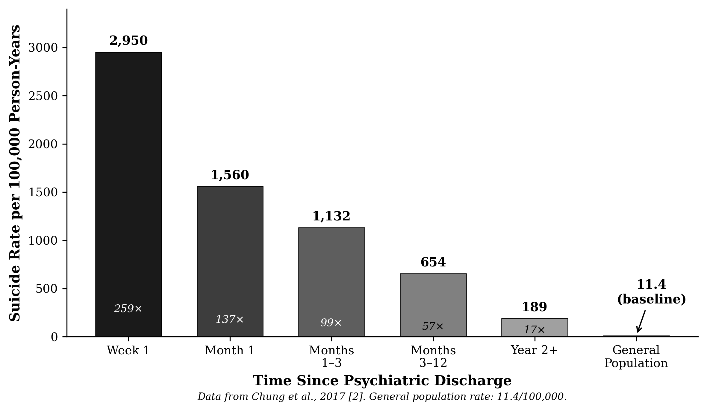
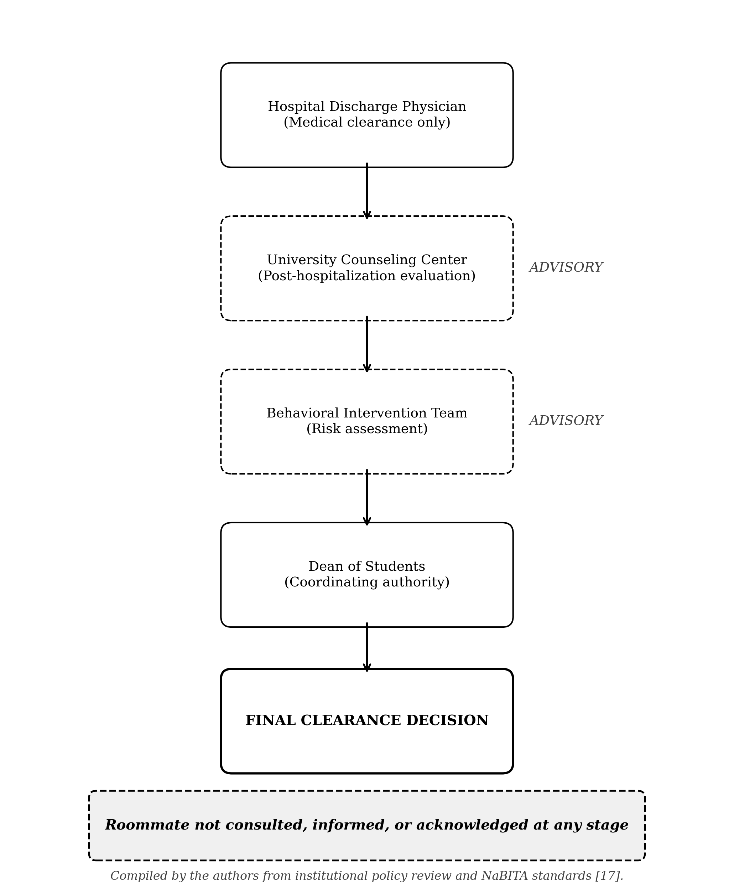
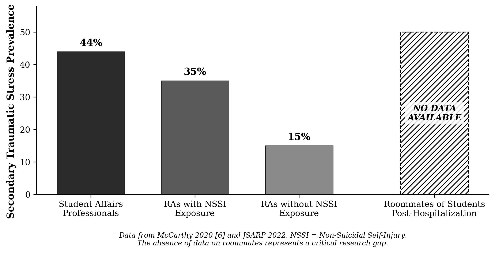

# The Other Side of the Room

## Mental Health Leave & Roommate Policy

**James H. Rosing, MD, FACS**  
*Allure MD Plastic Surgery and Dermatology, Newport Beach, California*

**Mark James Rosing**  
*Department of Biological Sciences, Dornsife College of Letters, Arts and Sciences, University of Southern California, Los Angeles, California*

**Ellie Shannon Rosing**  
*Institute for Society and Genetics, University of California, Los Angeles, California*

## ABSTRACT

When college students return to campus housing following psychiatric hospitalization, institutional policies appropriately focus on the returning student. However, one stakeholder remains systematically overlooked: the roommate. This perspective examines the evidence gap surrounding roommate impact, analyzes ethical tensions in current approaches, and proposes policy recommendations. A comprehensive literature review reveals no published research directly examining psychological, academic, or safety implications for roommates. Current frameworks prioritize privacy protection and disability accommodation for the returning student while treating the roommate as an externality. This paper argues that truly student-centered policies must acknowledge both students have needs, both deserve support, and the relationship between them is a clinical variable affecting clinical recovery, academic performance, and retention for both students. Policy recommendations address proactive roommate support, functional information sharing within privacy constraints, genuine choice architecture for housing decisions, and institutional acknowledgment of burden placed on uninvolved roommates.

**Keywords:** college mental health, school reintegration, roommate, residence life, medical leave of absence, psychiatric hospitalization, concerned other

## INTRODUCTION

The impetus for this review arose from an incidental clinical observation. A physician became aware that a college student’s roommate had returned to their shared residence hall following a psychiatric admission that escalated from a voluntary hold for danger to self, to an involuntary 72-hour hold, to a physician-ordered extension to 14 days with judicial review within three days. At hearing, the student was released and permitted to return to campus housing. The clinical trajectory (voluntary admission, involuntary conversion, extended hold, judicial release, and immediate return to a shared living environment) raised questions about the adequacy of transition planning. As a physician, the clinical considerations surrounding the returning student were familiar: discharge planning, continuity of care, risk assessment. What was unfamiliar was the complete institutional silence directed toward the roommate. No notification was provided, no support services were offered, and no acknowledgment was made that sharing a room with someone returning from a psychiatric crisis of this severity might constitute a significant stressor for an uninvolved 18-year-old. The privacy frameworks governing this silence (FERPA, HIPAA, and institutional policy) were designed to protect patients from discriminatory consequences of medical disclosure. These protections are essential. However, their application to the collegiate freshman roommate relationship warrants examination. The freshman roommate arrangement is temporally and structurally unique: two individuals with no prior relationship, no shared history, and no mutual selection are assigned to share a room of approximately 150 square feet during a period of significant developmental vulnerability. Privacy law as currently applied treats this relationship identically to any other institutional relationship, without accounting for the intimacy of the shared living environment or the asymmetric burden it creates when one roommate returns from psychiatric crisis. The roommate, an adult navigating this independently, was expected to absorb the situation without institutional recognition that it affected him at all.

Notably, even as a physician and parent, the reviewing author had no direct visibility into the situation. The roommate in question is an adult; his autonomy appropriately limited parental access to information. That constraint itself illustrates the problem: if a physician-parent with clinical training could not assess or intervene, an 18-year-old roommate with no clinical background and no institutional support had fewer resources still. This observation prompted a systematic examination of the literature. The findings were striking not for what they revealed but for what was absent. Despite the obvious relevance of roommate dynamics to both clinical outcomes and student welfare, this question has been almost entirely unstudied. The absence of research reflects and reinforces a policy framework that treats roommate impact as outside institutional responsibility, with consequences for every roommate who absorbs this burden invisibly.

## METHODS

This scoping review was conducted and reported in accordance with the Preferred Reporting Items for Systematic Reviews and Meta-Analyses extension for Scoping Reviews (PRISMA-ScR) [1]. The review was guided by three questions: (1) What does existing empirical research establish about the psychological, academic, and safety impact on roommates of college students returning to shared housing after psychiatric hospitalization? (2) How do current institutional policies and the governing legal and ethical frameworks address, or fail to address, the roommate as a stakeholder? (3) What policy and clinical measures could close the identified gaps while preserving privacy protections and disability accommodations?

The review employed a comprehensive search strategy across multiple literature domains. Database searches were conducted in PubMed, PsycINFO, ERIC, Google Scholar, and ProQuest Dissertations & Theses Global using combinations of the following terms: “school reintegration,” “psychiatric hospitalization,” “college student,” “roommate,” “residence hall,” “medical leave of absence,” “secondary traumatic stress,” “peer support,” “caregiver burden,” and “campus mental health policy.” Dissertations and theses were searched through ProQuest Dissertations & Theses Global and Google Scholar. The search was limited to English-language publications from 2000 to 2025, with seminal earlier works included when relevant. The search and source-selection process is summarized in Figure 1.

The policy and legal analysis was confined to the United States because the governing frameworks (FERPA, HIPAA, the ADA, Section 504, and Tarasoff-derived duty-to-warn doctrine) are jurisdiction-specific to the United States and do not translate across legal systems; the institutional policy review was correspondingly limited to U.S. universities. The clinical and empirical literature was not restricted by country of origin.

In addition to peer-reviewed literature, targeted searches were conducted of gray literature sources including professional organization publications (NASPA, ACUHO-I, American College Health Association), advocacy organization materials (JED Foundation, Bazelon Center for Mental Health Law, Active Minds), and institutional policy documents. Settlement agreements from major litigation (Stanford University 2019, Yale University 2023) were reviewed for policy language and terminology. University policy websites for major research institutions (Stanford, Yale, MIT, Cornell, UC Berkeley, USC) were systematically reviewed for medical leave of absence policies and return protocols.

Inclusion criteria for the review encompassed: (1) empirical studies examining outcomes following psychiatric hospitalization in college populations; (2) policy analyses of campus mental health frameworks; (3) research on secondary traumatic stress or caregiver burden in informal support relationships; (4) studies on roommate dynamics or residence hall communities; and (5) legal and ethical analyses of student privacy and disability accommodation. Studies were excluded if they focused exclusively on K-12 populations without implications for higher education, addressed only clinical treatment outcomes without consideration of campus reintegration, or were opinion pieces without empirical or policy grounding.

Information was extracted into two streams. For empirical sources, study characteristics, population, design, and findings relevant to roommate or analogous secondary-exposure outcomes were charted narratively. For policy and legal documents, a structured comparison was charted across predefined fields (mandatory-leave status, minimum duration, housing during leave, documented return rate, and the presence of any roommate provision), yielding the institutional comparison in Table 1.

No quantitative synthesis was appropriate given the absence of comparable outcome studies. Findings were integrated through narrative synthesis, grouping evidence into four domains: clinical and post-discharge risk, institutional policy, legal-ethical frameworks, and secondary traumatic stress and caregiver burden. These domains were read against the three research questions to locate where roommate impact is empirically and institutionally unaddressed.

The review specifically sought research addressing roommate psychological outcomes, academic impact on roommates, safety considerations in shared housing, and institutional support mechanisms for roommates. Existing reviews of school reintegration protocols and post-hospitalization procedures [2, 3] were examined for any attention to roommate-specific considerations. Terminology validation was conducted by examining usage patterns across JED Foundation frameworks, Bazelon Center model policies, settlement documents, and peer-reviewed journals including Psychiatric Services, Journal of American College Health, and Journal of Student Affairs Research and Practice.

***Figure 1. Search and Source-Selection Process***

## BACKGROUND: SCHOOL REINTEGRATION FOLLOWING PSYCHIATRIC HOSPITALIZATION

Psychiatric hospitalization among college students is not rare. The Center for Collegiate Mental Health reports that students with a history of suicide attempts or self-injury during counseling treatment are 14.3 times more likely to engage in subsequent self-injury and 5.6 to 6.5 times more likely to be hospitalized [4]. The post-discharge period carries extraordinarily elevated risk: a meta-analysis in JAMA Psychiatry found post-discharge suicide rates of 1,132 per 100,000 person-years in the first three months, approximately 100 times the global baseline rate [5]. The structure of the post-discharge transition itself appears to matter: a nationwide Finnish register study found that post-discharge suicide declined following reforms that decentralized and better coordinated transitional care [6].

Institutional responses to students returning from psychiatric hospitalization vary considerably. Some universities mandate medical leave of absence; others permit immediate return with support. The evidence comparing these approaches is remarkably thin. Shinn et al.’s longitudinal study of 114 college students with first-episode psychosis found that 82% experienced educational disruptions, with a median time to college return of 18 months [7]. Critically, the authors note that “blanket policies that force all students to take a leave of absence after hospitalization or a psychotic episode may not be universally helpful” (p. 9), but acknowledge the absence of comparative outcome data.

## INSTITUTIONAL POLICY LANDSCAPE

Recent legal settlements have shaped policy evolution significantly. Stanford University’s 2019 settlement, characterized as “the most comprehensive settlement ever to protect college students with mental health disabilities,” established that mandatory leaves must be a last resort following individualized assessment and guarantees housing upon return [8]. Yale’s 2023 settlement eliminated the previous 48-hour move-out requirement and introduced part-time study as a reasonable accommodation, with a reported 100% return rate post-settlement [9]. These developments appropriately center the rights and needs of students with psychiatric disabilities. What they do not address, and what no policy framework adequately addresses, is the impact on roommates.

A review of policies at major research universities reveals substantial variation in leave requirements and return protocols, but a consistent absence of roommate-focused provisions (Table 1).

***Table 1. Institutional Policy Comparison***

| Institution | Mandatory Leave | Minimum Duration | Housing on Leave | Return Rate | Ref. | Roommate Provisions |
|---|---|---|---|---|---|---|
| Stanford (post-2019) | Rare / last resort | 1 quarter min. | Can petition | Guaranteed | [8] | *None documented* |
| Yale (post-2023) | Voluntary only | No minimum | 48-hr move-out eliminated | 100% | [9] | *None documented* |
| MIT | Rare | 1 semester | Not permitted | Not published | [10] | *None documented* |
| Cornell | Via CAPS evaluation | Varies | Revoked if eval refused | Not published | [11] | *None documented* |
| UC Berkeley | Case-by-case | Must withdraw | Case-by-case | ~90% | [12] | *None documented* |
| USC | Both VHLA and MHLA | 1 semester to 1 year typical | Interim restriction on hospitalization | Not published | [13] | *None documented* |

Notably absent from all reviewed policies: any requirement for roommate notification, consultation, or support services.

***Figure 2. Post-Discharge Suicide Risk Timeline***

## THE DECISION-MAKING AUTHORITY CHAIN

Understanding who makes decisions about student return illuminates where roommate consideration could, but currently does not, enter the process. Hospital discharge physicians make medical determinations about discharge readiness but have no authority over university decisions. University counseling centers often conduct independent post-hospitalization evaluations with advisory (not binding) power. The Dean of Students typically serves as coordinating authority for final clearance decisions. Behavioral Intervention Teams (BITs) provide risk assessment using standardized tools like NaBITA standards [14], but are advisory rather than adjudicative.

The typical return process involves external provider documentation, followed by clinical review, administrative review, and final clearance. At no point in this chain is the roommate consulted, informed, or even acknowledged as a stakeholder in the decision.

***Figure 3. Decision-Making Authority Chain for Student Return***

## THE ROOMMATE NOTIFICATION VOID

A systematic search for explicit roommate notification policies found none. No major university publishes a requirement that roommates be informed before a student returns from psychiatric hospitalization. The JED Foundation’s comprehensive framework for student mental health mentions “discussions with roommates” (p. 13) but provides no implementation requirements or standards [15].

The consequences of this void are illustrated by individual cases known to the authors. In one incident at a major university, reported to the authors by a directly affected family, roommates were verbally reassured they would be notified before a peer’s return from hospitalization. The student returned unaccompanied with no notification provided. Roommates subsequently discovered the student “wandering halls carrying kitchen knives and cutlery” and later “found large knife hidden in kitchen cabinet.” One roommate shared a bedroom with the returning student. When roommates sought information, they were told only that the student “was safe” but staff were unable to provide details due to privacy constraints. Building staff had been notified but “not told when student will return.”

## THE OVERLOOKED STAKEHOLDER: THE “CONCERNED OTHER”

The JED Foundation Framework identifies roommates as “concerned others,” defined as non-professional support persons such as “a roommate, peer, or professor rather than an administrator or mental health professional” (p. 10) [15]. This terminology, while acknowledging the roommate’s existence, does not address the specific burden placed on someone sharing living quarters with a student in crisis or recovery.

Consider the position of the uninvolved roommate. They did not choose their roommate; assignment was random or algorithmically determined. They were not consulted when the crisis occurred. They likely witnessed or became aware of the psychiatric emergency, potentially experiencing their own acute stress response. Now they are being asked to resume sharing a 150-square-foot room with someone who has just experienced a significant psychiatric event, and they are being asked to do this without information about what happened, what to expect, what warning signs might indicate recurrence, or what they should do if they have concerns.

The roommate receives no training in mental health first aid. They have no clinical supervision. They cannot easily leave; relocating disrupts their own academic and social functioning, and social pressure makes such a choice feel like abandonment of someone vulnerable. They are, in effect, drafted into an informal support role without consent, compensation, or institutional acknowledgment that they are providing anything at all.

The asymmetry is stark. The returning student receives (appropriately) institutional support, clinical care, accommodations, case management, and resources. The roommate receives no comparable institutional support infrastructure.

## LEGAL AND ETHICAL FRAMEWORK

Current legal frameworks create genuine tensions that policy must navigate. FERPA governs virtually all student health records at postsecondary institutions [16]. The 2019 Joint DOE/HHS Guidance clarified that once health information is disclosed beyond treatment providers, it becomes an education record requiring consent for further disclosure. The health/safety emergency exception permits disclosure to “appropriate parties” only for “articulable and significant threat,” a standard that routine return from hospitalization does not automatically meet [17]. The exception applies to “actual, impending, or imminent” emergencies, not to notification that a student has returned.

HIPAA generally does not apply to campus health services (FERPA applies instead) but does govern external hospitals, which require patient authorization or threat exception before sharing information with universities. The ADA and Section 504 protect students with psychiatric disabilities from discrimination and cannot require disclosure as a condition of return unless “direct threat” criteria are met, requiring individualized assessment, not based on stereotypes, with reasonable modifications considered, and risk that is not remote or speculative [18, 19].

The duty to warn framework (Tarasoff) applies when a patient makes specific threats against identifiable victims, not to general psychiatric hospitalization [20]. Approximately 29 states have mandatory duty-to-warn statutes, 11 permissive, and 10 rely on case law. There is no general institutional duty to warn roommates absent specific threat. And indeed, there should not be: creating such a duty would almost certainly result in discriminatory exclusion of students with mental illness from campus housing.

But the absence of a legal duty does not mean the absence of an ethical obligation. The current system is designed to manage institutional liability and protect one student’s privacy rights while treating the roommate as an externality. It optimizes for the institution’s legal exposure, not for the wellbeing of both students.

## INSTITUTIONAL LIABILITY PRESSURES

The legal landscape is dominated by two categories of litigation: students suing for discrimination under ADA, Section 504, and Fair Housing Act provisions, and families suing after student suicides. The Stanford and Yale settlements demonstrate successful litigation against restrictive policies [8, 9]. A review of case law found no significant documented cases of roommates harmed appearing in the litigation record, likely reflecting both rarity of severe incidents and absence of clear duty creating liability exposure.

This asymmetric litigation environment creates predictable institutional incentives: robust protection against discrimination claims (favoring student retention and accommodation) with minimal pressure to address roommate concerns. The Bazelon Center for Mental Health Law serves as the primary advocacy organization for students with psychiatric disabilities [21]; no parallel constituency advocates for roommates. Any research finding roommate harm could potentially be weaponized to justify exclusionary policies, creating an implicit consensus not to look too closely.

## THE EVIDENCE GAP

A comprehensive search of peer-reviewed literature, dissertations, gray literature, and professional organization publications reveals a near-complete absence of research on roommate impact. No published studies specifically examine psychological impact on roommates when a student returns from psychiatric hospitalization, secondary traumatic stress in peer roommates, academic impact on roommates living with students post-crisis, caregiver burden or fatigue in college roommate relationships, or qualitative research on roommate perspectives.

Related research provides indirect signals of potential impact. Two studies that exploit randomized first-year roommate assignment offer the most direct signal: Golberstein and colleagues documented spillover in mental health service use between assigned roommates [22], and a longitudinal study of college roommates examined how depressive symptoms relate to academic outcomes within the dyad [23]. Together these establish that roommates measurably influence one another’s mental health and academic functioning, which makes the complete absence of research on the post-hospitalization roommate all the more conspicuous. McCarthy (2020) found that Resident Assistants who encountered residents with nonsuicidal self-injury demonstrated significantly higher levels of burnout and secondary traumatic stress than RAs who did not [24]. If trained, compensated staff experience secondary trauma, untrained roommates who cannot easily exit their living situation are likely at equal or greater risk. Research on resident assistants similarly links close support work around peers’ mental health crises to compassion fatigue and secondary traumatic stress [25]. A study in the Journal of Student Affairs Research and Practice found that 44% of sampled student affairs professionals met minimum criteria for secondary traumatic stress [26].

Research on trauma exposure suggests plausible mechanisms. A case-control study of 28 high school students who witnessed a peer’s suicide found higher rates of new-onset anxiety disorder and a trend toward increased PTSD relative to matched controls [27]. UK research on higher education staff following a student suicide documented flashbacks and intrusive imagery, sleeplessness, and anxiety [28]. The DSM-5-TR criteria for post-traumatic stress disorder include witnessing a traumatic event as it occurs to others and learning that such an event has happened to a close associate, exposures that can encompass proximity to a peer’s suicidal crisis [29]. Caregiver burden research consistently finds that caregivers of individuals with mental illness experience approximately twice the psychological anguish of the general population [30].

***Figure 4. Secondary Traumatic Stress Prevalence in Campus Populations***

## CLINICAL DISCHARGE PLANNING GAPS

Joint Commission standards for psychiatric discharge do not address shared housing appropriateness assessment. Hospital-university communication is fragmented: a study of 17,053 discharges found communication with outpatient providers occurred in only 70% of cases (62% for Medicaid patients) [31]. The Center for Mental Health in Schools at UCLA notes that “it is both the hospital’s and school’s duty to be in regular communication. This frequently is not the case” (p. 2) [32].

Specialized programs exist but are not universal. McLean Hospital’s College Mental Health Program works with students from more than 200 colleges and universities [33]. NewYork-Presbyterian operates a dedicated College Student Program [34]. Best practice protocols such as Fordham’s address student readiness for academic and social pressures, but not whether shared housing with a specific roommate is appropriate [35]. Research indicates 30-50% of psychiatric inpatients fail to attend follow-up within 30 days [36, 37], suggesting the post-discharge transition period is poorly managed even for the patient, let alone consideration of their living environment.

## THE RELOCATION QUESTION

When housing disruption occurs, who should relocate? This question has no clean answer, but the considerations are worth articulating. Arguments for relocating the returning student include: they are the one whose situation changed; they may benefit clinically from a more appropriate housing configuration (single room, proximity to counseling services, reduced social performance demands); they already have institutional support and case management engaged; and they can advocate for themselves with clinical backing. This framing positions relocation not as punishment but as accommodation, matching housing to current clinical needs.

Arguments for relocating the uninvolved roommate include: keeping the returning student in their familiar environment may support stability; the roommate, being psychiatrically stable, may be better positioned to absorb relocation without clinical consequence; and requiring the student with a disability to relocate could be framed as discriminatory.

Perhaps the question itself is wrong. The right answer may be that neither should be forced to relocate, but both should be offered genuine, supported, stigma-free options. The returning student should be offered (not required) housing that might better support their recovery. The roommate should be offered (not pressured either direction) relocation with explicit institutional messaging that this is a legitimate choice, not abandonment. The problem with current practice is the coercion embedded in either direction.

## POLICY RECOMMENDATIONS

The following recommendations aim to address the identified gaps while respecting privacy constraints and disability protections.

1. Proactive Support for Roommates

The current approach (“let us know if you have problems”) places the burden on an 18-year-old to recognize when they need help and advocate for themselves. Universities should implement scheduled check-ins with roommates (separate from the returning student), explicit acknowledgment that this situation may be stressful for them, and clear pathways to support that do not require them to “report” on their roommate. Counseling services should proactively offer sessions to roommates, framed as support for a stressful living situation rather than surveillance of the returning student.

2. Functional Information Sharing Within Privacy Constraints

The binary of “disclose diagnosis” versus “share nothing” is false and unhelpful. With the returning student’s consent, functional information can be shared that gives the roommate something actionable without violating medical privacy: “Your roommate may need more sleep than usual and might have some medication that affects their schedule. Here’s who to contact if you have concerns.” This approach respects autonomy (the returning student consents to what is shared), provides practical guidance, and avoids the total opacity that serves no one well.

3. Genuine Choice Architecture for Housing Decisions

If the institution offers relocation but implicit social pressure makes it feel like abandonment, that is not a real choice. Universities should affirmatively communicate that choosing to relocate is legitimate, is not a judgment on the returning student, and will be handled with discretion. Similarly, the returning student should be offered (not mandated) alternative housing configurations that might support recovery (single room, different floor, proximity to support services) framed as accommodation rather than exile. Both students should have genuine options with genuine support for either choice.

4. Institutional Acknowledgment of Burden

At minimum, institutions should name explicitly what they are asking of the roommate: “We’re asking something of you, and we want to support you in that.” The current practice of pretending the roommate’s situation is unchanged fails everyone. Acknowledgment costs nothing and provides validation that the roommate’s experience matters.

5. Developmental Context Consideration

An 18-year-old freshman potentially living away from home for the first time, still forming their own identity and coping mechanisms, is developmentally different from a senior with established support systems. The capacity to absorb stress without harm is not evenly distributed. This argues for more intensive support structures, not less, in freshman housing scenarios specifically. The developmental context extends beyond the individual student to the family system. Contemporary American college freshmen, while legally adults, typically maintain significantly closer integration with their immediate families than earlier generational cohorts. The transition to independence is gradual, and the expectation that an 18-year-old will independently recognize, process, and seek help for secondary traumatic stress, without disclosing the situation to family, assumes a level of autonomous coping that developmental research does not support. The freshman roommate arrangement itself warrants scrutiny as a structural vulnerability. Unlike virtually any other living arrangement available to adults, university housing assigns two individuals with no prior relationship, no shared history, and no mutual selection to share an intimate living space during a period of acute developmental transition. This arrangement is involuntary in the sense that most freshmen have no meaningful alternative; it is intimate in the sense that 150 square feet permits no meaningful separation; and it is unsupervised in the sense that no institutional framework monitors whether the arrangement remains appropriate when circumstances change. Few adults outside of military service, where extensive institutional support structures exist, would voluntarily accept comparable living conditions with a stranger experiencing psychiatric crisis. The absence of any parallel support infrastructure for the college roommate reflects not a considered policy judgment but an institutional blind spot. Universities should consider whether existing communication frameworks, including emergency contact protocols already established at matriculation, might appropriately extend to situations where a roommate’s living environment has been materially altered by circumstances beyond their control or knowledge.

6. Clinical Integration of Roommate Considerations

Treating psychiatrists making return recommendations should consider the roommate situation as a clinical variable. What is the roommate dynamic? Has anyone talked to the roommate? Does the roommate have their own support? Is there genuine capacity for this roommate to be a neutral or positive presence, or are there existing tensions that could create a harmful environment for both students? The expressed emotion literature is clear that high-stress home environments predict worse outcomes [38, 39]; a hostile or resentful roommate harms the returning student too. Ignoring roommate wellbeing is not just unfair to the roommate; it is clinically shortsighted for the patient.

7. Improved Hospital-University Communication

With appropriate consent, hospitals should communicate with university counseling services about discharge planning. The McLean Hospital model of structured collaboration between a psychiatric program and students’ colleges should be more widely adopted [33]. Discharge planning should explicitly address whether shared housing is appropriate and what supports need to be in place before return.

8. Research Investment

The absence of research on roommate impact is itself a policy choice. Funding agencies, institutional review boards, and universities should prioritize studies examining psychological and academic outcomes for roommates of students returning from psychiatric hospitalization, secondary traumatic stress in this population, factors that predict positive versus negative roommate adjustment, and effectiveness of roommate support interventions. The evidence gap cannot be addressed without deliberate investment in filling it.

## CONCLUSION

The current system treats roommates as externalities: collateral in decisions made about and for someone else. This paper has argued that the roommate is also a student deserving support, that the roommate relationship is a clinical variable for the returning student, and that conscripting an 18-year-old into informal caregiving without acknowledgment is ethically untenable.

But the roommate question is more than one overlooked stakeholder. It is a stress test of what “student-centered” actually means. A policy regime can be simultaneously progressive toward the returning student and silent toward the person across the room, because the two postures are produced by the same engine: one is shaped by the threat of discrimination litigation, the other by the absence of any countervailing pressure. The roommate’s invisibility is therefore not an oversight at the margins of an otherwise humane system; it is a direct readout of whose suffering the system was built to count. An institution that can fund case management, accommodations, and clinical review for one student while offering the other nothing but “let us know if you have problems” has not centered students, it has centered its own exposure.

The corrective does not require new law, new funding, or any erosion of disability protections. It requires only that institutions adopt a relational rather than individual unit of care: when a returning student’s housing is cleared, the roommate is named, acknowledged, and offered support as a matter of routine, not exception. That single change of treating both the roommate and the patient as the object of planning costs little and forecloses the most preventable harms described here.

The absence of research on this question is itself a finding. The systematic failure to ask what happens to the other side of the room reflects institutional and scholarly priorities that have consequences for every roommate who absorbs this burden invisibly. The first obligation is not to solve the problem but to stop averting our eyes from it. It is time to look and, having looked, to count both students.

## REFERENCES

1. Tricco AC, Lillie E, Zarin W, et al. PRISMA Extension for Scoping Reviews (PRISMA-ScR): checklist and explanation. Ann Intern Med. 2018;169(7):467-473.

2. Marraccini ME, Lee S, Chin AJ. School reintegration post-psychiatric hospitalization: protocols and procedures across the nation. School Ment Health. 2019;11(3):615-628.

3. Tougas A-M, Houle A-A, Leduc K, Frenette-Bergeron É, Marcil K. School reintegration following psychiatric hospitalization: a review of available transition programs. J Can Acad Child Adolesc Psychiatry. 2022;31(2):75-92.

4. Center for Collegiate Mental Health. 2022 Annual Report. University Park, PA: Penn State University; 2023.

5. Chung DT, Ryan CJ, Hadzi-Pavlovic D, Singh SP, Stanton C, Large MM. Suicide rates after discharge from psychiatric facilities: a systematic review and meta-analysis. JAMA Psychiatry. 2017;74(7):694-702.

6. Pirkola S, Sohlman B, Heilä H, Wahlbeck K. Reductions in postdischarge suicide after deinstitutionalization and decentralization: a nationwide register study in Finland. Psychiatr Serv. 2007;58(2):221-226.

7. Shinn AK, Cawkwell PB, Bolton K, et al. Return to college after a first episode of psychosis. Schizophr Bull Open. 2020;1(1):sgaa041.

8. Disability Rights Advocates. Stanford and students with mental health disabilities reach landmark settlement. Press release. September 10, 2019.

9. Southeast ADA Center. Yale students, alumni reach settlement agreement to resolve lawsuit against Yale University. 2023.

10. MIT Office of the Dean for Student Life. Medical Leave and Return Policy. Cambridge, MA: Massachusetts Institute of Technology; 2024.

11. Cornell University. Leaves of Absence for Undergraduate Students. Ithaca, NY: Office of the Dean of Students; 2024.

12. University of California, Berkeley. Withdrawal and Readmission Policy. Berkeley, CA: Office of the Registrar; 2024.

13. University of Southern California. Student Health Leave of Absence Policy. Los Angeles, CA: Office of Campus Wellness and Crisis Intervention; 2024.

14. National Behavioral Intervention Team Association (NaBITA). Risk Rubric Standards. 2020.

15. The Jed Foundation. Framework for Developing Institutional Protocols for the Acutely Distressed or Suicidal College Student. New York, NY: The Jed Foundation; 2006, updated 2021.

16. U.S. Department of Education & U.S. Department of Health and Human Services. Joint Guidance on the Application of FERPA and HIPAA to Student Health Records. Washington, DC; 2019.

17. U.S. Department of Education. FERPA General Guidance for Students. 34 CFR §§ 99.31(a)(10), 99.36.

18. Americans with Disabilities Act of 1990, 42 U.S.C. § 12101 et seq.

19. Section 504 of the Rehabilitation Act of 1973, 29 U.S.C. § 794.

20. Tarasoff v. Regents of the University of California, 17 Cal. 3d 425 (1976).

21. Bazelon Center for Mental Health Law. Campus Mental Health: Know Your Rights! A Guide for Students. Washington, DC: Judge David L. Bazelon Center for Mental Health Law; 2008.

22. Golberstein E, Eisenberg D, Downs MF. Spillover effects in health service use: evidence from mental health care using first-year college housing assignments. Health Econ. 2016;25(1):40-55.

23. Quinn EL, Eisenberg D, Golberstein E, Shevrin C, Weissman S. Understanding the role of depressive symptoms in academic outcomes: a longitudinal study of college roommates. PLoS One. 2023;18(6):e0286709.

24. McCarthy MR. Resident assistant secondary trauma and burnout associated with student nonsuicidal self-injury. J Am Coll Health. 2020;68(4):344-350.

25. Lynch RJ. Work environment factors impacting the report of secondary trauma in U.S. resident assistants. J Coll Univ Stud Hous. 2019;46(1):62-78.

26. Lynch RJ, Glass CR. The development of the Secondary Trauma in Student Affairs Professionals Scale (STSAP). J Stud Aff Res Pract. 2019;56(1):1-18.

27. Brent DA, Perper JA, Moritz G, et al. Adolescent witnesses to a peer suicide. J Am Acad Child Adolesc Psychiatry. 1993;32(6):1184-1188.

28. Causer H, Bradley E, Muse K, Smith J. Bearing witness: a grounded theory of the experiences of staff at two United Kingdom higher education institutions following a student death by suicide. PLoS One. 2021;16(5):e0251369.

29. American Psychiatric Association. Diagnostic and Statistical Manual of Mental Disorders. 5th ed, text revision (DSM-5-TR). Washington, DC: American Psychiatric Association Publishing; 2022.

30. Pinquart M, Sörensen S. Differences between caregivers and noncaregivers in psychological health and physical health: a meta-analysis. Psychol Aging. 2003;18(2):250-267.

31. Betz ME, Boudreaux ED. Managing suicidal patients in the emergency department. Ann Emerg Med. 2016;67(2):276-282.

32. Center for Mental Health in Schools at UCLA. Transitioning from Psychiatric Hospitalization to Schools. Los Angeles, CA: School Mental Health Project, Department of Psychology, UCLA; 2017. Accessed May 2026. https://smhp.psych.ucla.edu/pdfdocs/hospital.pdf

33. McLean Hospital. College Mental Health Program. Belmont, MA: McLean Hospital; established 2008. Accessed May 2026. https://www.mcleanhospital.org/treatment/cmhp

34. NewYork-Presbyterian. College Student Program. White Plains, NY: NewYork-Presbyterian Westchester Behavioral Health Center. Accessed May 2026. https://www.nyp.org/psychiatry/college-student-program

35. Fordham University. Student Reintegration Protocol Following Mental Health Leave. New York, NY: Office of the Dean of Students; 2022.

36. Olfson M, Wall M, Wang S, et al. Short-term suicide risk after psychiatric hospital discharge. JAMA Psychiatry. 2016;73(11):1119-1126.

37. Ho TP. The suicide risk of discharged psychiatric patients. J Clin Psychiatry. 2003;64(6):702-707.

38. Hooley JM. Expressed emotion and relapse of psychopathology. Annu Rev Clin Psychol. 2007;3:329-352.

39. Butzlaff RL, Hooley JM. Expressed emotion and psychiatric relapse: a meta-analysis. Arch Gen Psychiatry. 1998;55(6):547-552.

## DISCLOSURE STATEMENT

The authors report no conflicts of interest. The authors alone are responsible for the content and writing of this article. The authors received no funding for this work. The first author (J.H.R.) is a board-certified plastic and reconstructive surgeon whose clinical training informed the analytical framework but does not constitute a conflict of interest. The impetus for this review was personal experience as the parent of a college student who was the roommate of a peer returning from psychiatric hospitalization.

**Ethical Approval:** This study is a review of published literature, publicly available policy documents, legal settlements, and institutional policies. No human subjects research was conducted, no original data were collected from participants, and no interventions were performed. Accordingly, this work is exempt from Institutional Review Board review under 45 CFR 46.104 (category 4, secondary research for which consent is not required). The study did not involve procedures requiring ethical approval under the Declaration of Helsinki.

**Informed Consent:** This article includes a personal disclosure regarding the circumstances that prompted the review. Verbal informed consent was obtained from all co-authors, including the family members referenced in the disclosure, for the inclusion of this personal context. No identifiable patient or third-party information is disclosed in this manuscript.

**AI-Assisted Preparation Disclosure:** Claude Opus 4.5 (Anthropic, 2025) was used during manuscript preparation for the following purposes: (1) literature search support to identify existing research pertaining to the subject matter; (2) validation of graphical representations of factual data from cited sources, including synthesis of overlapping data patterns for enhanced comprehension; (3) grammatical refinement for formal academic register; (4) spelling verification; (5) revalidation of all cited sources; and (6) communicative clarity review, specifically evaluation of whether written language effectively transfers information from author to reader as intended. All intellectual content, arguments, policy recommendations, and conclusions are solely the work of the authors. The AI tool was used as an editorial assistant; it did not generate original content, analysis, or recommendations.

## CORRESPONDENCE

James H. Rosing, MD, FACS

Allure MD Plastic Surgery and Dermatology

Newport Beach, California

drrosing@allure-md.com
